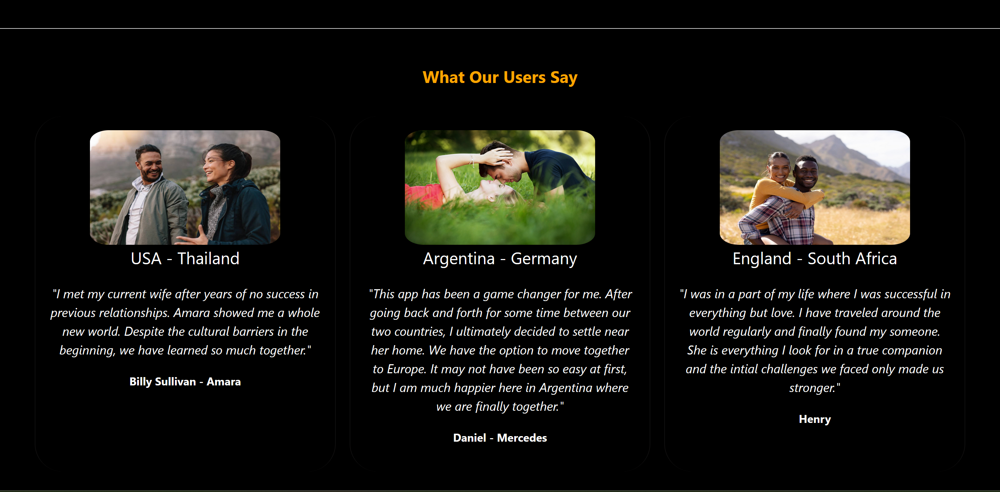

# dating-app
International dating app which allows users to search and message other potential matches from across the globe. App built using MERN (data stored in Mongo DB). You can access the demo and sign up on the site here: https://passportmatch.netlify.app

# App Features
* Real Time Messaging using socket.io
* Search users by name / gender / age-range / country of origin
* Upload image + video of user which displays on profile page
* Images and videos are also saved through cloudinary
* Ability for user to update and change their picture and self video
* Notification alert when receiving message
* Applicable for smaller screens

# In process
* Currently adding message board to allow users to post messages + upload images regarding anything they want for other users to see (based on continental selection)

# App Walkthrough
# Homepage
* Login / Signup built in component - allows users to add information ranging from country of origin and age to their personal image and video
* Brief information describing app outline and features to potential clients

# Dashboard 
* Sidedrawer (navbar) allowing users to navigate between other features of app
* Performs search engine which allows users to find others based on gender / age-range / country of origin
* Results that generate based on those specific criteria allows the viewer to access selected users profile page as well as directly message them

# Profile Page
* Display users basic information along with their image and personal video
* All users have access to viewing other profile pages

# Search user by name / email
* Search bar on left side of sidedrawer allows users to search by name or email
* Selecting a user navigates them to the chatpage where they have a chatbox allocated and saved between both clients
* After selecting and opening the chatbox between both users, they now have the ability to message one another
* User can also view recipients avatar

# Edit Profile
* Users can edit their name / image / or video at anytime

# Chatbox - Real-time Messaging / Notification
* Users can select which user they would like to communicate with
* Recipients avatar which includes their basic information can be opened 
* Message notifications will appear for users currently not engaged in the conversation

# Can be used on small screens

