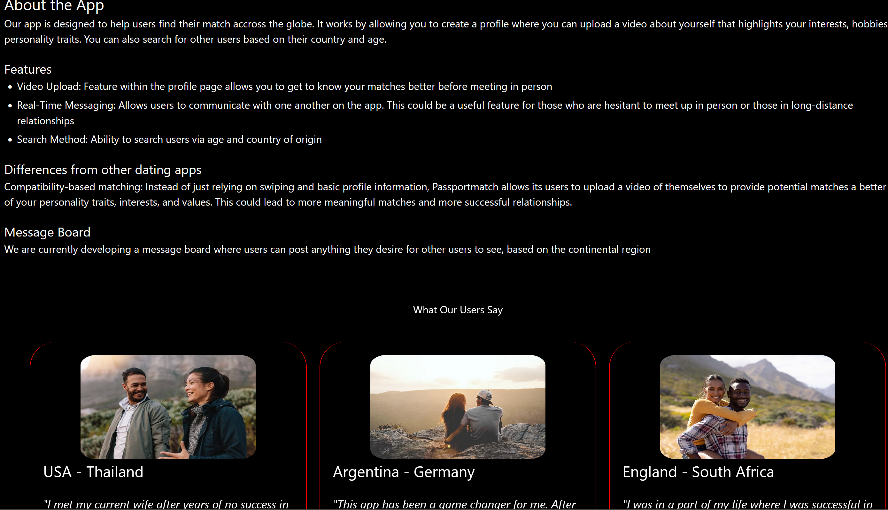

# dating-app
International dating app which allows users to search and message other potential matches from across the globe. App built using MERN (data stored in Mongo DB). 

# App Features
* Real Time Messaging using socket.io
* Search users by name / gender / age-range / country of origin
* Upload image + video of user which displays on profile page
* Ability for user to update and change their picture and self video
* Notification alert when receiving message

# In process
* Currently adding message board to allow users to post messages + upload images regarding anything they want for other users to see (based on continental selection)

# App Walkthrough
# Homepage
* Login / Signup built in component - allows users to add information ranging from country of origin and age to their personal image and video
* Brief information describing app outline and features to potential clients

# Dashboard 
* Sidedrawer (navbar) allowing users to navigate between other features of app
* Performs search engine which allows users to find others based on gender / age-range / and their country of origin
* Results that generate based on those specific criteria allows the viewer to access selected users profile page as well as directly message them

# Profile Page
* Display users basic information along with their image and personal video
* All users have access to viewing other profile pages

# Search user by name / email
* Search bar on left side of sidedrawer allows users to search by name or email
* Selecting a user navigates them to the chatpage where they have a chatbox allocated and saved between both clients
* After selecting and opening the chatbox between both users, they now have the ability to message one another

